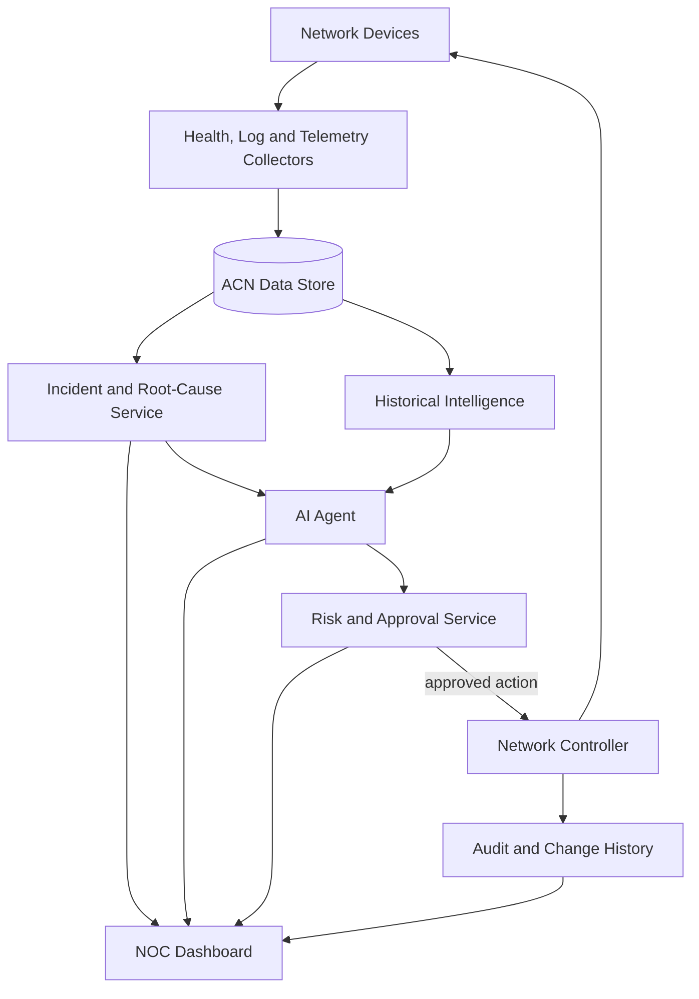
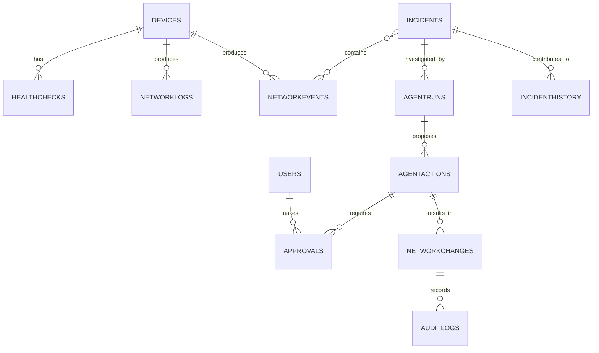

# ACN Functional and Technical Specification

## 1. System overview

ACN, or **AI-Centered Network**, is an intelligent network-operations system that monitors network infrastructure, detects and correlates faults, determines likely root causes, and assists operators with controlled remediation of common recurring problems.

The platform collects health checks, logs and protocol telemetry from network devices. This data is normalized into events and incidents. A deterministic analysis engine and an AI agent investigate each incident, while risk and approval controls ensure that network changes are performed safely. A web-based Network Operations Centre (NOC) dashboard provides live monitoring, administration, reporting and audit information.

ACN addresses the problem of network teams receiving large volumes of disconnected alerts without a clear explanation of what failed, what was affected, or how the problem should be resolved. It focuses on frequent problems such as unreachable devices, failed links, disabled interfaces and lost routing neighbours.

## 2. System objectives

- **OBJ-01:** Continuously monitor the availability and performance of network devices.
- **OBJ-02:** Collect and normalize health checks, logs and protocol telemetry.
- **OBJ-03:** Correlate related events into meaningful incidents.
- **OBJ-04:** Identify probable device, interface, link and routing failures.
- **OBJ-05:** Use AI to provide an independent and explainable incident investigation.
- **OBJ-06:** Recommend or perform controlled network actions according to risk level.
- **OBJ-07:** Require human approval for high-risk changes.
- **OBJ-08:** Maintain a complete audit trail of incidents, decisions and network changes.
- **OBJ-09:** Use historical incident data to improve future investigations.
- **OBJ-10:** Provide a reliable environment for resolving common network faults repeatedly and consistently.

## 3. Project scope

### 3.1 In scope

The completed ACN system includes:

- Network-device discovery and management.
- ICMP, SNMP and gNMI health and performance monitoring.
- Collection of interface, OSPF and BGP telemetry.
- Raw network-log storage and normalization.
- Live network event generation.
- Incident detection, correlation and lifecycle management.
- Deterministic root-cause analysis.
- AI-assisted incident investigation.
- Recommended and automated remediation actions.
- Risk classification and approval workflows.
- Rollback and post-change verification.
- User authentication and role-based access control.
- Incident acknowledgement, assignment and comments.
- Historical incident analysis and pattern recognition.
- Reporting, audit records and operational dashboards.
- Reliable data storage and recovery for the local ACN environment.

### 3.2 Out of scope

The system does not replace the underlying routers, switches or vendor management platforms. It does not make unrestricted network changes, bypass approval policies, or guarantee that every physical hardware fault can be repaired automatically.

### 3.3 System boundary

ACN is responsible for observation, data normalization, incident handling, investigation, decision support, controlled actions, verification and auditing. Network devices remain responsible for forwarding traffic and applying configuration. Supporting services provide identity, data storage and AI capabilities where required.

## 4. Actors and user roles

| Actor | Description | Main responsibilities |
|---|---|---|
| NOC operator | Monitors daily network operations | Views alerts, acknowledges incidents and performs approved actions |
| Network engineer | Investigates and resolves technical faults | Reviews evidence, approves changes and manages devices |
| Approver | Authorizes higher-risk actions | Reviews risk, impact and rollback plans |
| Administrator | Manages the ACN platform | Manages users, roles, policies and integrations |
| Auditor | Reviews historical activity | Views incidents, approvals, actions and change records |
| AI agent | Investigates incidents | Analyses evidence and recommends suitable actions |
| Monitoring services | Collect network information | Produce health checks, logs and events |
| Network Controller | Executes approved changes | Applies, verifies and rolls back network actions |
| External network devices | Supply operational information | Respond to monitoring and accept authorized configuration changes |

## 5. User requirements

### UR-01: Monitor network status

**As a NOC operator, I want to view the live health of all devices, so that I can quickly identify outages or degraded performance.**

### UR-02: Investigate incidents

**As a network engineer, I want related events grouped into incidents, so that I can understand the complete fault rather than individual alerts.**

### UR-03: Review root cause

**As a network engineer, I want to see the probable root cause and its supporting evidence, so that I can make an informed decision.**

### UR-04: Receive AI assistance

**As a NOC operator, I want the AI agent to investigate incidents and recommend actions, so that faults can be resolved faster.**

### UR-05: Approve risky actions

**As an approver, I want high-risk actions to wait for authorization, so that unsafe changes are not performed automatically.**

### UR-06: Perform controlled remediation

**As a network engineer, I want approved actions to be executed and verified, so that incidents can be resolved safely.**

### UR-07: Review historical incidents

**As a network engineer, I want to find similar past incidents and successful solutions, so that previous experience can guide current decisions.**

### UR-08: Audit system activity

**As an auditor, I want to review who approved and performed each change, so that the platform remains accountable.**

## 6. Main use cases

### UC-01: Detect a network fault

1. ACN collects health checks, logs and protocol telemetry.
2. A change in device, interface or routing state is detected.
3. The observation is normalized into a network event.
4. Related events are grouped into an incident.
5. The incident is displayed on the NOC dashboard.

**Result:** The operator receives a clear incident instead of multiple unrelated alerts.

### UC-02: Investigate an incident

1. The Incident Service determines an initial root cause.
2. The AI agent receives the incident and its evidence.
3. The AI agent produces an independent diagnosis.
4. ACN compares both conclusions.
5. Supporting events, logs and historical matches are shown to the operator.

**Result:** The incident contains an explainable and traceable diagnosis.

### UC-03: Approve and execute remediation

1. The AI agent or operator proposes an action.
2. ACN assigns a risk level.
3. Low-risk actions may execute automatically according to policy.
4. Medium- or high-risk actions are sent for approval.
5. The Network Controller applies the approved change.
6. ACN verifies the outcome and rolls back the change if necessary.

**Result:** The network is changed through a controlled and auditable process.

### UC-04: Use historical intelligence

1. ACN compares a new incident with previous incidents.
2. Similar symptoms, causes and actions are identified.
3. Previous successful or failed outcomes are presented.
4. The historical information contributes to the current recommendation.

**Result:** Repeated incidents can be handled more consistently and efficiently.

### UC-05: Manage users and access

1. A user signs in securely.
2. ACN verifies the user identity and assigned role.
3. The dashboard displays functions allowed for that role.
4. Restricted operations require the correct permission.
5. User actions are recorded in the audit log.

**Result:** Users can access only the information and operations they are authorized to use.

## 7. Functional requirements

| ID | Requirement | Priority |
|---|---|---|
| FR-001 | The system shall discover and monitor configured network devices. | Must |
| FR-002 | The system shall collect health checks, logs and protocol telemetry. | Must |
| FR-003 | The system shall normalize observations into standard network events. | Must |
| FR-004 | The system shall preserve raw evidence for later inspection. | Must |
| FR-005 | The system shall correlate related events into incidents. | Must |
| FR-006 | The system shall identify probable root causes and affected devices. | Must |
| FR-007 | The system shall compare predicted impact with observed impact. | Must |
| FR-008 | The AI agent shall investigate incidents using available evidence. | Must |
| FR-009 | AI conclusions shall cite supporting events and logs. | Must |
| FR-010 | The system shall compare new incidents with historical incidents. | Should |
| FR-011 | The system shall recommend suitable remediation actions. | Must |
| FR-012 | Every proposed action shall receive a risk classification. | Must |
| FR-013 | High-risk actions shall require human approval. | Must |
| FR-014 | The Network Controller shall execute only authorized actions. | Must |
| FR-015 | The system shall verify the result of every network change. | Must |
| FR-016 | The system shall support rollback when verification fails. | Must |
| FR-017 | The dashboard shall provide live topology, incident and action views. | Must |
| FR-018 | Users shall authenticate before accessing protected ACN functions. | Must |
| FR-019 | Access shall be restricted according to user role. | Must |
| FR-020 | The system shall retain a complete audit history. | Must |
| FR-021 | The system shall support search, filtering and reporting. | Should |
| FR-022 | Failures in one service shall not stop the monitoring pipeline. | Must |

## 8. Validation and business rules

- The first device observation establishes a baseline and does not create a false alert.
- Raw logs are stored even when they cannot be normalized.
- Related events are correlated using time, topology and device relationships.
- Root-cause conclusions must include supporting evidence.
- AI citations must refer to valid evidence stored by ACN.
- Every proposed action must include its target, expected result and risk level.
- High-risk actions cannot execute without approval.
- An approver cannot approve an action without the required role.
- Network changes must record their previous and resulting state.
- Failed verification triggers rollback when rollback is available.
- Incidents are resolved only after network recovery is confirmed.
- All approvals, actions and administrative changes are audited.

## 9. System architecture

ACN uses a service-based, event-driven architecture. Monitoring services collect information from network devices and store normalized data in a central platform. Other services consume these events to create incidents, perform investigations and execute controlled actions.

This design separates monitoring, analysis, decision-making and network control. It improves maintainability and safety because each service has a clear responsibility.

## 10. Technology stack

| Purpose | Technology |
|---|---|
| Programming language | TypeScript |
| Runtime | Node.js |
| Frontend | Angular |
| Operational database | Firestore |
| Historical analysis | Indexed incident and change history |
| Network emulation | Docker and Containerlab |
| Routing | FRRouting with OSPF and BGP |
| Monitoring | ICMP, SNMP, gNMI and device logs |
| AI | OpenAI Responses API |
| Authentication | Firebase Authentication |
| Operation | Local services and containers |
| Testing | Unit, integration and end-to-end testing |

## 11. Technical requirements

- Services must communicate through secure and authenticated connections.
- Secrets and API keys must be stored outside source code.
- The platform must support the local lab and demonstration environment.
- Monitoring services must process device checks asynchronously.
- Data writes must preserve evidence relationships and timestamps.
- Stored data must support suitable retention, indexing and recovery.
- Services must be independently startable and recoverable.
- The AI service must not bypass action and approval controls.
- Network actions must be idempotent where possible.
- The system must provide logging, metrics and service health checks.
- The dashboard must support modern desktop and mobile browsers.

## 12. Database and data model

| Entity | Purpose |
|---|---|
| `users` | Stores user and role information |
| `devices` | Stores managed network devices |
| `healthChecks` | Stores device health and performance results |
| `networkLogs` | Stores raw device logs |
| `networkEvents` | Stores normalized operational events |
| `incidents` | Stores correlated faults and root causes |
| `agentRuns` | Stores AI investigations and evidence |
| `agentActions` | Stores proposed remediation actions and risk levels |
| `approvals` | Stores approval decisions and comments |
| `networkChanges` | Stores executed changes, verification and rollback results |
| `auditLogs` | Stores user and system activity |
| `incidentHistory` | Stores searchable historical patterns and outcomes |

## 13. Security

ACN uses authenticated access and role-based authorization. Operators, engineers, approvers, administrators and auditors receive different permissions. Backend services use dedicated identities with only the permissions required for their responsibilities.

API keys and credentials are stored outside source code in protected environment configuration. Client applications cannot directly modify protected monitoring or audit records.

The AI agent cannot execute network changes directly. Every action passes through validation, risk classification, authorization and the Network Controller. All important user and system activities are recorded for audit purposes.

## 14. Performance and reliability

ACN uses asynchronous monitoring, batched writes, indexed queries and bounded dashboard results. Health checks and logs are separated from current incident data and managed through simple retention rules.

Services operate independently so that failure in the AI, dashboard or action layer does not stop basic monitoring. Failed checks and actions are recorded clearly, while verified rollback helps the system recover from unsuccessful changes.

## 15. Error handling

Individual device, database, AI or action failures do not stop the complete monitoring pipeline. Services record useful errors and continue processing other work.

Failed AI investigations are shown clearly without replacing the deterministic diagnosis. Failed network actions are verified, reported and rolled back when possible. Dashboard users receive understandable feedback when data or services are temporarily unavailable.

## 16. Configuration and operation

ACN operates in a local laboratory environment. Its network runs in containers, while the monitoring, incident, AI and controller services are configured through environment variables and protected local secrets.

Separate development and testing configurations prevent test data and credentials from being mixed with normal demonstrations.

## 17. Testing and quality assurance

The completed platform includes:

- Unit tests for monitoring, parsing, correlation, AI investigation and risk rules.
- Integration tests for database, identity, approval and controller services.
- End-to-end tests for device failure, link failure, approval and remediation flows.
- Security tests for authentication and authorization.
- Reliability tests for repeated incidents and normal monitoring workloads.
- Recovery tests for service, database and network-action failures.
- User-interface and acceptance testing for all main roles.

All increments are considered complete once their functional requirements and end-to-end acceptance tests pass.

## 18. Implementation status

| Increment | Scope | Status |
|---|---|---|
| 1 | Network lab, health monitoring and Firestore | Complete |
| 2 | Raw logs and event normalization | Complete |
| 3 | Incident detection and root-cause correlation | Complete |
| 4 | Read-only AI incident investigation | Complete |
| 5 | Controlled network actions | Complete |
| 6 | Risk levels and approval workflow | Complete |
| 7 | Full authenticated NOC dashboard | Complete |
| 8 | Historical incident intelligence | Complete |
| 9 | Advanced SNMP, gNMI and routing monitoring | Complete |
| 10 | Reliable storage, recovery and system maintenance | Complete |

## 19. Traceability summary

| Objective | Main requirements | Main component |
|---|---|---|
| Monitor the network | FR-001–FR-004 | Monitoring services |
| Detect and diagnose incidents | FR-005–FR-009 | Incident Service and AI Agent |
| Use historical intelligence | FR-010 | Historical Intelligence Service |
| Remediate safely | FR-011–FR-016 | Risk Service and Network Controller |
| Provide an operational interface | FR-017–FR-019 | NOC dashboard and authentication |
| Maintain accountability | FR-020–FR-022 | Audit, reporting and service monitoring |

## 20. Conclusion

ACN provides an end-to-end intelligent network-operations solution. It monitors network infrastructure, converts telemetry into meaningful incidents, explains probable root causes, uses AI and historical information to recommend solutions, and performs approved remediation through a controlled process.

The completed platform combines observability, explainable AI, human approval, controlled network fixes and auditability in one integrated local NOC environment.
