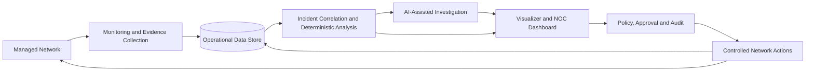

# ACN Functional and Technical Specification

## Document purpose

This document specifies the proposed **AI-Centered Network (ACN)** solution. It describes the problem the system is intended to address, the capabilities that should be provided, the principal technical design considerations, and the criteria by which the solution may be evaluated.

The specification is written as a pre-implementation planning document. It defines intended behaviour and design direction without assuming that the described features have already been built.

---

## 1. Introduction

### 1.1 Background

Network operations teams often receive large volumes of health alerts, protocol messages, and device logs from separate tools. Although these observations may indicate the same underlying problem, they are frequently presented without sufficient correlation or explanation. Engineers must therefore spend time assembling evidence, identifying the probable cause, estimating the impact, and deciding how the fault should be resolved.

ACN is proposed as an intelligent network-operations solution that brings these activities into a single, explainable workflow. The system will collect operational observations, identify related failures, use deterministic and artificial-intelligence-assisted analysis to diagnose problems, and guide or perform controlled resolution of approved routine tasks.

### 1.2 Purpose of the system

The purpose of ACN is to reduce the time and effort required to identify and resolve recurring network problems while preserving operator oversight and a clear audit trail. Artificial intelligence is central to the proposed solution: it will examine the available evidence, explain its reasoning, identify likely root causes, and recommend an appropriate response. Safety controls will prevent the AI capability from making unrestricted changes to network infrastructure.

### 1.3 Intended audience

This specification is intended for:

- project supervisors and academic evaluators;
- network operators and network engineers;
- system analysts, designers, and developers;
- security, governance, and audit stakeholders; and
- testers responsible for functional and technical validation.

### 1.4 Scope of this document

The document covers the proposed functional behaviour, system features, user and external interfaces, high-level architecture, data considerations, security controls, quality requirements, and acceptance principles for ACN.

Detailed implementation instructions, vendor-specific configuration commands, deployment addresses, and source-code design are outside the scope of this specification.

---

## 2. General description

### 2.1 Product perspective

ACN will operate as a network-operations support platform alongside existing network devices and management practices. It will not replace routing, switching, or vendor management systems. Instead, it will observe network state, consolidate evidence, provide AI-assisted analysis, and coordinate controlled responses through approved interfaces.

The proposed solution will combine the following logical capabilities:

- collection of network health and operational telemetry;
- storage of raw and normalized evidence;
- event correlation and incident management;
- deterministic and AI-assisted root-cause analysis;
- recommendation and controlled execution of routine resolution tasks;
- operator approval, verification, rollback, and audit controls; and
- a visual dashboard for monitoring, investigation, and controlled scenario initiation.

### 2.2 Problem statement

Routine network faults are often technically simple but operationally expensive. The same symptoms may be caused by different failures, and a response based only on a single alert can worsen the problem. ACN should help operators answer four questions consistently:

1. What changed in the network?
2. Which services, devices, or users are affected?
3. What is the most likely underlying cause?
4. What is the safest suitable action to restore normal operation?

### 2.3 System objectives

| ID | Objective |
|---|---|
| OBJ-01 | Observe the health and operational state of managed network infrastructure. |
| OBJ-02 | Convert diverse network observations into consistent, traceable evidence. |
| OBJ-03 | Correlate related symptoms into meaningful incidents. |
| OBJ-04 | Use AI-assisted analysis to identify and explain probable root causes. |
| OBJ-05 | Support the safe resolution of recurring and routine network tasks. |
| OBJ-06 | Preserve human oversight for actions that may affect network availability. |
| OBJ-07 | Verify the outcome of a change and support recovery when the result is unsuccessful. |
| OBJ-08 | Present live network, incident, investigation, and action information in a clear visual interface. |
| OBJ-09 | Maintain evidence and audit records for accountability and later learning. |

### 2.4 User classes and external actors

| Actor | Intended role |
|---|---|
| NOC operator | Observes network state, reviews incidents, and initiates permitted routine workflows. |
| Network engineer | Investigates complex incidents, reviews evidence, and authorises or performs technical actions. |
| Approver | Reviews risk, expected impact, and rollback information before higher-risk actions. |
| Administrator | Manages system configuration, integrations, policies, and access. |
| Auditor or evaluator | Reviews evidence, decisions, actions, and outcomes. |
| AI investigation service | Analyses incident evidence and produces an explainable diagnosis and recommendation. |
| Monitoring sources | Supply device health, logs, and protocol or interface observations. |
| Network control interface | Applies only validated and authorised changes to managed infrastructure. |

### 2.5 Assumptions and dependencies

The planned solution assumes that:

- managed devices expose sufficient health, log, or protocol information;
- network topology and device identity can be established accurately;
- operational data can be stored with reliable timestamps;
- an AI service is available when AI investigation is required;
- approved network changes can be applied through a controlled interface; and
- operators remain responsible for exceptional, ambiguous, or high-impact failures.

### 2.6 Constraints

- The AI capability must be advisory unless a separately authorised action workflow permits execution.
- Loss of the AI service must not stop basic monitoring or deterministic diagnosis.
- Network actions must be limited to known targets and approved action types.
- The system must retain the original evidence used to reach a conclusion.
- The solution should remain suitable for a controlled laboratory environment while allowing later extension to broader environments.

### 2.7 Out of scope

The initial ACN solution is not intended to:

- replace the forwarding or routing functions of network devices;
- perform unrestricted autonomous configuration changes;
- repair physical hardware;
- guarantee a correct diagnosis when evidence is incomplete; or
- replace the professional judgement of a network engineer for novel or high-risk incidents.

---

## 3. Functional requirements

### 3.1 Monitoring and evidence collection

| ID | Requirement | Priority |
|---|---|---|
| FR-001 | The system shall monitor the availability and operational condition of configured network devices. | Must |
| FR-002 | The system shall collect relevant health checks, device logs, interface state, and routing-protocol observations. | Must |
| FR-003 | The system shall preserve raw observations so that later conclusions can be traced to their source. | Must |
| FR-004 | The system shall normalize supported observations into a consistent event format. | Must |
| FR-005 | The system shall distinguish a new fault from an initial healthy baseline and from a recovery event. | Must |

### 3.2 Incident detection and correlation

| ID | Requirement | Priority |
|---|---|---|
| FR-006 | The system shall group related events into an incident using time, device, topology, and protocol relationships. | Must |
| FR-007 | The system shall identify affected devices or services where the available evidence permits this. | Must |
| FR-008 | The system shall track an incident from detection through investigation, action, verification, and resolution. | Must |
| FR-009 | The system shall avoid merging unrelated failures merely because they occur close together. | Should |

### 3.3 AI-assisted identification of network problems

| ID | Requirement | Priority |
|---|---|---|
| FR-010 | The system shall provide an incident and its relevant evidence to an AI investigation capability. | Must |
| FR-011 | The AI investigation shall identify a probable root cause or explicitly state that the evidence is insufficient. | Must |
| FR-012 | The AI investigation shall explain its conclusion in language suitable for a network operator. | Must |
| FR-013 | The AI investigation shall refer to the evidence supporting its conclusion. | Must |
| FR-014 | The system shall compare the AI conclusion with deterministic analysis where both are available. | Must |
| FR-015 | A disagreement between AI and deterministic analysis shall be visible to the operator and shall not be hidden or automatically resolved. | Must |

### 3.4 Routine task identification and resolution

ACN is intended to identify and assist with recurring tasks that have known symptoms, bounded impact, and a predictable recovery procedure. Representative routine tasks include:

1. **Configuration drift or incorrect configuration** — detecting when an operational setting differs from the intended state and recommending or restoring the approved value.
2. **Logical routing-neighbour or protocol-session failure** — identifying a lost or misconfigured routing relationship even when the underlying device and link remain available.
3. **Administratively disabled interface or logical-port misconfiguration** — detecting that a required interface or logical port has been disabled or placed in an unintended state.
4. **Routing-service or daemon failure** — distinguishing failure of a routing process from failure of the complete network device.
5. **Resource exhaustion affecting a network service** — identifying when bounded resource pressure prevents a routing or control-plane service from operating normally.

Additional routine tasks may include recovery from a known device reachability problem, validation of restored connectivity, and reapplication of a previously approved standard configuration.

| ID | Requirement | Priority |
|---|---|---|
| FR-016 | The system shall classify supported routine incidents into an appropriate problem category. | Must |
| FR-017 | The system shall recommend a resolution that is compatible with the identified cause and available evidence. | Must |
| FR-018 | A proposed action shall identify its target, expected result, risk, and verification method. | Must |
| FR-019 | The system shall require operator approval when policy or risk level does not permit automatic execution. | Must |
| FR-020 | Only approved and validated actions shall be sent to the network control interface. | Must |
| FR-021 | The system shall verify whether the intended state and service have been restored after an action. | Must |
| FR-022 | The system shall support rollback or escalation when verification fails. | Should |
| FR-023 | The system shall record the action, authorisation, output, and result. | Must |

### 3.5 Visualizer and operator dashboard

| ID | Requirement | Priority |
|---|---|---|
| FR-024 | The system shall provide a dashboard showing current network state and recent operational activity. | Must |
| FR-025 | The dashboard shall present incidents, evidence, probable causes, AI investigations, and action status in a connected workflow. | Must |
| FR-026 | The dashboard shall allow users to filter or focus the operational timeline. | Should |
| FR-027 | In a controlled demonstration environment, the dashboard shall allow an operator to initiate approved fault scenarios for observation and testing. | Should |
| FR-028 | Before a fault scenario is initiated, the dashboard shall identify the selected scenario and request clear confirmation. | Must |
| FR-029 | The dashboard shall provide understandable feedback when a scenario or action request is accepted or fails. | Must |
| FR-030 | Scenario controls shall be separated conceptually from AI investigation so that the AI remains unable to inject faults directly. | Must |
| FR-031 | The dashboard shall remain usable when live data is delayed or an optional service is unavailable. | Should |

### 3.6 Audit and historical support

| ID | Requirement | Priority |
|---|---|---|
| FR-032 | The system shall retain an audit record of significant incident, investigation, approval, and action activity. | Must |
| FR-033 | The system should allow previous incidents and outcomes to be reviewed when investigating a similar problem. | Should |
| FR-034 | Audit information shall distinguish human decisions, AI recommendations, and automated system activity. | Must |

---

## 4. System features and use cases

### 4.1 Feature: Observe network state

**Primary actor:** NOC operator

**Goal:** Understand whether managed devices and services are operating normally.

**Main flow:**

1. Monitoring sources collect operational observations.
2. ACN stores the raw observations and derives normalized events.
3. Current device and service state is updated.
4. The dashboard presents the latest state and recent changes.

**Expected outcome:** The operator can distinguish a healthy network from a degraded or uncertain state.

### 4.2 Feature: Detect and investigate an incident

**Primary actor:** Network engineer

**Goal:** Determine the likely cause and impact of a network problem.

**Main flow:**

1. Related events are correlated into an incident.
2. Deterministic analysis produces an initial interpretation.
3. The AI capability independently reviews the incident evidence.
4. The system compares the conclusions and identifies agreement or disagreement.
5. The dashboard presents the incident, evidence, reasoning, confidence, and affected scope.

**Alternative flow:** If evidence is insufficient or the AI service is unavailable, the incident remains available with deterministic findings and a clear limitation notice.

**Expected outcome:** The engineer receives an explainable diagnosis rather than an isolated alert.

### 4.3 Feature: Resolve a routine task

**Primary actor:** Network engineer or authorised operator

**Goal:** Restore normal operation safely for a recognised routine failure.

**Main flow:**

1. ACN classifies the incident and proposes a suitable response.
2. The proposal states the target, expected effect, risk, and verification plan.
3. Policy determines whether approval is required.
4. An authorised actor approves the action where necessary.
5. The controlled action is applied.
6. ACN observes the resulting network state.
7. The action is marked successful, rolled back, or escalated.

**Expected outcome:** A routine fault is resolved through a traceable process without granting unrestricted control to the AI capability.

### 4.4 Feature: Initiate a controlled fault scenario

**Primary actor:** Operator or evaluator

**Goal:** Demonstrate and assess ACN behaviour using a known network condition.

**Main flow:**

1. The user selects a permitted scenario in the visualizer.
2. The visualizer explains the selected condition and asks for confirmation.
3. The scenario controller accepts or rejects the request.
4. The visualizer reports the request outcome.
5. ACN observes the resulting evidence, incident, diagnosis, and recovery in the same way as an operational event.

**Expected outcome:** The planned monitoring and investigation workflow can be demonstrated safely and repeatedly.

### 4.5 Feature: Review investigation history

**Primary actor:** Network engineer or auditor

**Goal:** Understand previous incidents, decisions, and outcomes.

**Main flow:**

1. The user selects a previous incident or searches by relevant criteria.
2. ACN presents the original evidence, diagnosis, recommendation, approval, action, and result.
3. Similar outcomes may be considered during a later investigation.

**Expected outcome:** Operational experience remains available for accountability and future decision support.

---

## 5. External interface requirements

### 5.1 User interface

The primary user interface will be a web-based visualizer or NOC dashboard. It should:

- present network state without requiring users to interpret raw storage records;
- use consistent severity, status, and confidence indicators;
- connect incidents to their supporting events and raw evidence;
- distinguish AI conclusions from deterministic conclusions;
- present confirmations and action results within the application;
- provide accessible keyboard navigation, readable labels, and clear focus behaviour; and
- adapt to common desktop and smaller-screen layouts.

### 5.2 Network and monitoring interfaces

ACN will require read access to supported device health, interface, log, and routing information. These interfaces should be isolated from action interfaces so that observation does not implicitly grant configuration rights.

### 5.3 AI service interface

The AI interface will receive a bounded incident context containing only the evidence required for investigation. The response should use a structured form that supports a root-cause category, explanation, confidence, and evidence references. Untrusted device text must be treated as evidence rather than as instructions.

### 5.4 Network control interface

The network control interface will accept only recognised actions with validated targets and appropriate authorisation. It should return sufficient information for the system to determine whether an action was accepted, completed, or failed.

### 5.5 Data-store interface

The system will require persistent storage for current state, raw observations, normalized events, incidents, investigations, scenario or action records, approvals, and audit history. User-facing clients should receive only the access required for their role.

---

## 6. Technical specification

### 6.1 Architectural approach

ACN is planned as a modular, service-oriented solution. Separate responsibilities will allow monitoring and deterministic diagnosis to continue when optional capabilities, such as AI investigation or the visualizer, are unavailable.

### 6.2 Logical components

| Component | Planned responsibility |
|---|---|
| Monitoring and evidence collection | Obtain device health, logs, interface state, and protocol observations. |
| Normalization | Convert supported observations into a common event representation. |
| Incident service | Correlate events, maintain incident state, and perform deterministic analysis. |
| AI investigation service | Produce an independent, explainable, evidence-based diagnosis. |
| Policy and approval service | Determine risk and ensure that required authorisation is obtained. |
| Network control service | Apply approved routine actions and support verification or rollback. |
| Scenario controller | Initiate only predefined demonstration conditions in a controlled environment. |
| Visualizer or dashboard | Present network state, incidents, evidence, investigations, and action feedback. |
| Operational data store | Preserve the state and evidence required by the other components. |

### 6.3 Data flow

The principal data flow will be:

1. A monitoring source observes network state.
2. The raw observation is stored with its source and time.
3. Supported observations are normalized into events.
4. Related events are correlated into an incident.
5. Deterministic and AI-assisted analysis evaluate the incident.
6. The dashboard presents the evidence and conclusions.
7. An approved response may be sent to the network control service.
8. New observations verify recovery or indicate that escalation is required.

At each stage, references should be retained so that a user can move from a conclusion back to the evidence on which it was based.

### 6.4 Conceptual data model

| Information group | Purpose |
|---|---|
| Devices and topology | Identify managed elements and their relationships. |
| Health observations | Record availability and basic performance results. |
| Raw network evidence | Preserve device and service output without losing original context. |
| Normalized events | Represent relevant changes in a consistent form. |
| Incidents | Group related symptoms, impact, lifecycle, and probable cause. |
| AI investigations | Store conclusions, reasoning, confidence, and evidence references. |
| Scenario and action records | Track requested work, progress, output, and outcome. |
| Approvals and audit records | Record authorisation and accountable activity. |

### 6.5 Technical requirements

| ID | Requirement |
|---|---|
| TR-001 | Components shall use well-defined interfaces and exchange validated data. |
| TR-002 | Operational records shall include reliable identifiers and timestamps. |
| TR-003 | Evidence relationships shall be preserved across events, incidents, investigations, and actions. |
| TR-004 | Monitoring shall continue when AI investigation or the user interface is unavailable. |
| TR-005 | AI requests shall be bounded, auditable, and protected from instructions contained in untrusted network evidence. |
| TR-006 | Secrets and privileged credentials shall be kept outside client applications and source documents. |
| TR-007 | Network write access shall be separated from monitoring and AI investigation. |
| TR-008 | Action processing shall provide clear accepted, completed, failed, and verification states. |
| TR-009 | The design shall support repeatable automated testing without requiring live production changes. |
| TR-010 | The system shall allow components to be replaced or extended without redesigning the complete workflow. |

---

## 7. Nonfunctional requirements

### 7.1 Security and safety

- Users should be authenticated before accessing protected operational functions.
- Access should be limited according to operational responsibility.
- Privileged actions should require explicit authorisation and should be fully audited.
- The AI capability must not hold unrestricted network credentials.
- Device logs and external input must be validated and treated as untrusted data.
- Sensitive configuration and credentials must not be exposed in the visualizer or audit output.

### 7.2 Reliability and availability

- Failure of one optional component should not stop basic observation and evidence collection.
- Temporary data-store or integration failures should be reported clearly and retried where safe.
- Duplicate observations or repeated requests should not cause unsafe repeated actions.
- Recovery should be confirmed from new observations rather than assumed from a successful command response.

### 7.3 Performance

- New operational information should become visible within a period appropriate for incident response.
- Recent dashboard views should use bounded data sets so that historical growth does not degrade normal operation.
- Incident analysis should prioritize relevant evidence rather than processing unrelated historical data.

### 7.4 Usability and accessibility

- Status, severity, confidence, and action outcomes should use consistent language and visual treatment.
- Important actions should have human-readable labels and confirmation messages.
- The dashboard should support keyboard use and clear focus movement.
- Errors should explain what failed and what the operator can do next.
- The visualizer should avoid presenting an empty display as proof that the network is healthy.

### 7.5 Maintainability and extensibility

- Monitoring, analysis, AI, action, and presentation responsibilities should remain separated.
- New event or routine-task categories should be addable without changing unrelated components.
- Common data definitions should be consistent across services.
- Significant business rules should be testable independently of external services.

### 7.6 Scalability

The initial solution may target a controlled environment, but the design should allow additional devices, observations, incidents, and users to be introduced. Growth should be supported through bounded queries, suitable data retention, asynchronous processing, and independently scalable components where required.

### 7.7 Auditability and explainability

- Every diagnosis should be traceable to stored evidence.
- AI output should be identifiable as AI-generated and should include an understandable explanation.
- Human approval and automated activity should be distinguishable.
- Changes and verification outcomes should be retained for review.

---

## 8. Validation and acceptance approach

The planned system should be evaluated through a combination of unit, integration, end-to-end, and user-interface testing.

### 8.1 Functional validation

Acceptance should demonstrate that:

- healthy baseline observations do not create false incidents;
- supported faults produce appropriate events and incidents;
- the five representative routine fault categories can be distinguished from one another;
- deterministic and AI conclusions retain valid evidence references;
- AI uncertainty and disagreement are shown honestly;
- authorised actions cannot bypass the required policy and approval steps;
- action results are verified from subsequent network state;
- the dashboard presents live state, evidence, and feedback coherently; and
- fault scenarios cannot be initiated without an explicit user action and clear confirmation.

### 8.2 Technical validation

Technical testing should cover:

- data validation and evidence traceability;
- component failure and recovery;
- unavailable AI or storage dependencies;
- duplicate and concurrent requests;
- access-control boundaries;
- safe handling of untrusted log content;
- performance under representative monitoring volume; and
- operation without paid or production services where a deterministic test substitute is appropriate.

### 8.3 User acceptance

Representative operators should be able to observe a fault, understand its impact, review the AI-assisted explanation, distinguish the proposed response from the diagnosis, and follow the outcome of an authorised action without requiring knowledge of the internal implementation.

---

## 9. Planned delivery approach

The following sequence provides a practical implementation plan without implying completion status:

1. Establish the controlled network environment, device inventory, and health monitoring.
2. Collect raw operational evidence and normalize supported events.
3. Correlate events into incidents and develop deterministic diagnosis.
4. Add read-only AI-assisted investigation and evidence comparison.
5. Introduce the visualizer for network, incident, investigation, and scenario observation.
6. Add controlled routine actions, policy, approval, verification, and rollback.
7. Add authentication, role-based access, audit review, and historical intelligence.
8. Evaluate scalability, reliability, advanced monitoring, and broader deployment needs.

Each phase should be accepted only after its stated functional and technical criteria have been demonstrated.

---

## 10. Requirements traceability summary

| Objective | Related requirements | Principal capability |
|---|---|---|
| Observe the network | FR-001–FR-005 | Monitoring and evidence collection |
| Detect and explain incidents | FR-006–FR-015 | Correlation, deterministic analysis, and AI investigation |
| Resolve routine tasks safely | FR-016–FR-023 | Recommendation, approval, control, and verification |
| Provide an operational visualizer | FR-024–FR-031 | Dashboard and controlled scenarios |
| Preserve accountability and learning | FR-032–FR-034 | Audit and historical support |

---

## Appendix A: Representative routine problem categories

| Category | Functional interpretation | Intended outcome |
|---|---|---|
| Configuration drift or incorrect configuration | A relevant setting differs from the intended operational state. | Identify the difference and recommend or restore the approved state. |
| Logical routing-neighbour or protocol-session failure | A routing relationship is unavailable or misconfigured while the underlying device may remain operational. | Restore the intended protocol relationship without misclassifying the whole device as failed. |
| Disabled interface or logical-port misconfiguration | A required interface or logical port is administratively disabled or incorrectly configured. | Restore the intended interface state and verify dependent connectivity. |
| Routing-service or daemon failure | A routing process fails while the device itself remains reachable. | Restore the affected service and verify routing recovery. |
| Resource exhaustion affecting a network service | Resource pressure prevents a network service from operating normally. | Relieve the bounded pressure, restore the service, and confirm stable operation. |

## Appendix B: Glossary

| Term | Meaning |
|---|---|
| ACN | AI-Centered Network. |
| Deterministic analysis | Rule-based analysis whose conclusion follows defined logic. |
| Evidence | A stored health result, log, event, or related observation used during investigation. |
| Incident | A group of related operational events representing a network problem and its lifecycle. |
| Routine task | A recurring network problem with a known, bounded, and testable response. |
| Scenario | A predefined condition introduced in a controlled environment for demonstration or testing. |
| Visualizer | The user-facing dashboard used to observe network state, incidents, investigations, and controlled scenarios. |
