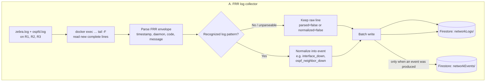
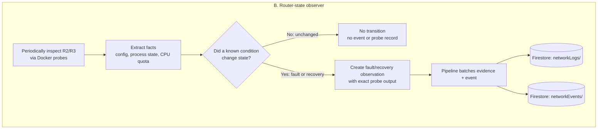
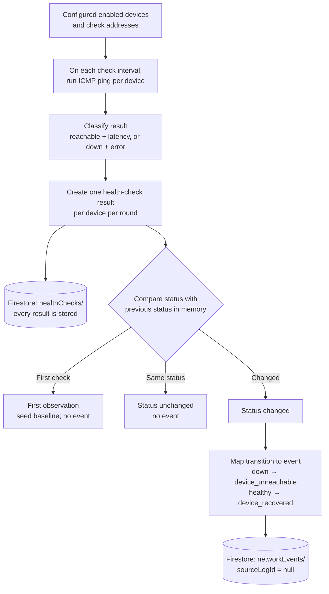
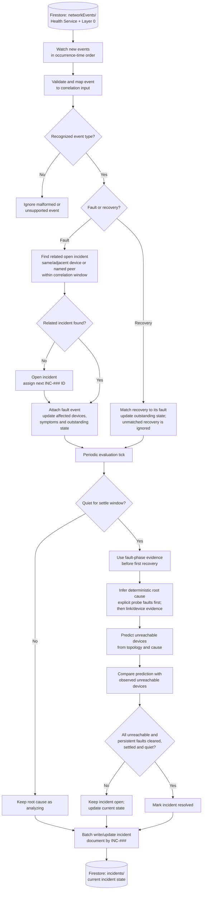
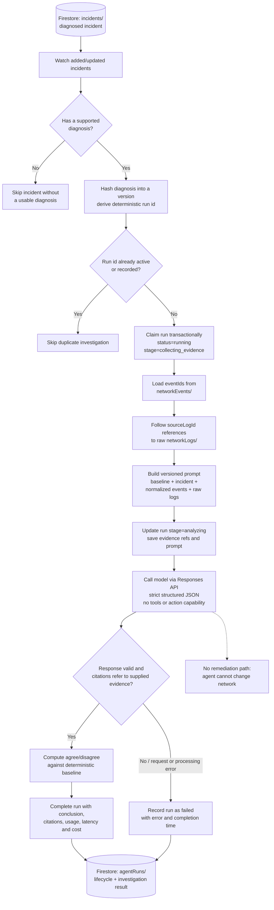
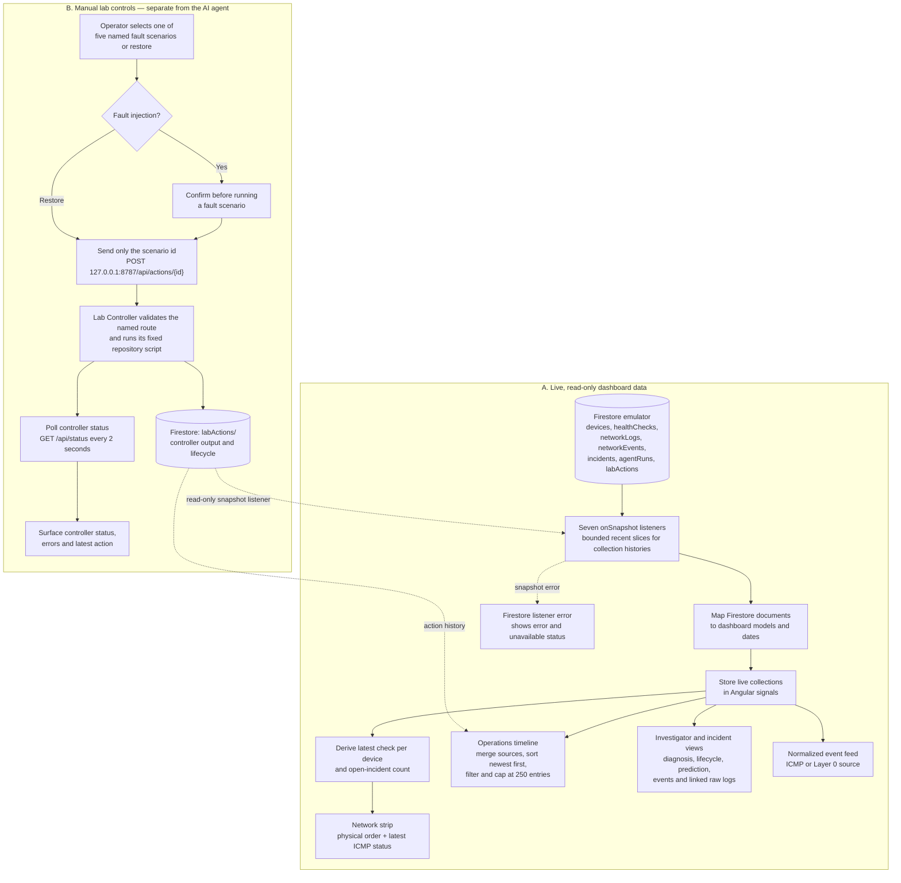
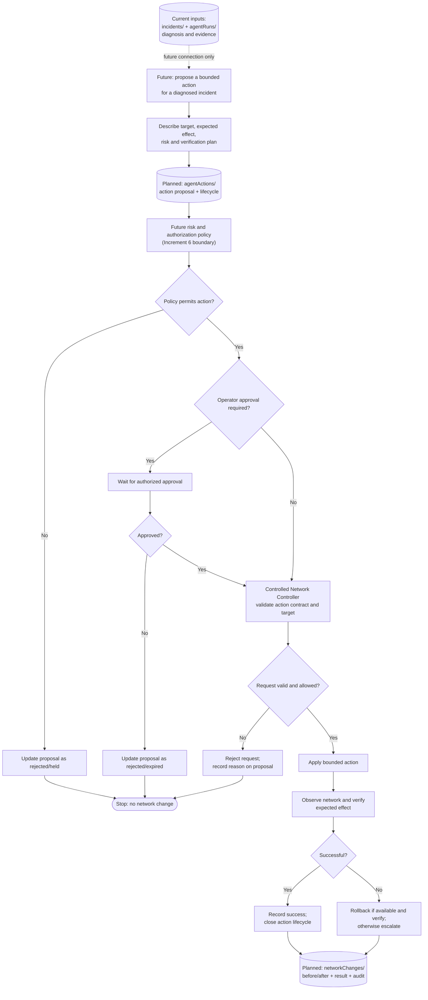

# Function Diagrams

This document collects flow diagrams for specific ACN logic units. The diagrams
show each unit's inputs, transformations, decisions, and outputs.

## Services and responsibilities

This table describes the components that make up the current runnable system.
“Purpose” is the plain-language reason an operator or user would care about
each component.

| Service or component | State | Active duties and responsibilities | Purpose in the system |
| --- | --- | --- | --- |
| Containerlab + FRR network | Running lab infrastructure | Runs the simulated PC1—R1—R2—R3—PC2 network; FRR provides routing and emits router logs. | A safe, repeatable network to monitor and use for fault demonstrations. |
| Health Service | Implemented backend service | Pings configured data-plane addresses, stores each check in `healthChecks/`, and emits `device_unreachable` / `device_recovered` events on reachability changes. | Answers “which devices can I reach, and when did that change?” |
| Layer 0 | Implemented backend service | Tails FRR logs and probes selected router state; preserves raw evidence in `networkLogs/` and writes recognized fault/recovery transitions to `networkEvents/`. | Turns router messages and state observations into traceable, normalized evidence. |
| Firestore Emulator | Local data store | Stores devices, health checks, raw logs, normalized events, incidents, agent runs, and lab actions; backend services write through the Admin SDK while the dashboard reads through the Firebase SDK. | The shared, live record of what the system observed and concluded. |
| Incident Service | Implemented backend service | Consumes `networkEvents/`, correlates related symptoms, waits for evidence to settle, determines a reproducible root cause, tracks recovery, and writes `incidents/`. | Turns individual signals into an understandable incident with a diagnosis. |
| Agent Service | Implemented, read-only backend service | Reads diagnosed incidents and linked event/log evidence, requests an independent structured investigation, validates citations, compares conclusions with the baseline, and writes lifecycle/results to `agentRuns/`. | Provides a second opinion with evidence and an auditable record; it cannot change the network. |
| OpenAI Responses API (GPT-5.6 Luna) | External dependency used by Agent Service | Receives the investigation prompt and supplied evidence, then returns a structured conclusion; no tools or action capability are provided. | Supplies the AI investigation, while ACN retains control of evidence, validation, and recording. |
| Angular NOC dashboard | Implemented operator-facing web app | Subscribes to recent Firestore data, renders topology, timeline, incidents, evidence, events and agent runs, and reports listener errors. All Firestore access from the browser is read-only. | Lets an operator see the end-to-end pipeline and inspect why ACN reached a conclusion. |
| Lab Controller | Implemented localhost-only control service | Accepts only named scenario IDs, maps them to repository-owned scripts, allows one action at a time, and records status/output in `labActions/`. | Provides fixed manual fault-injection and restore controls for the synthetic lab without granting the AI action authority. |
| Lab scenario scripts | Implemented fixed action targets | Apply one of five named lab fault scenarios or restore the lab; scripts do not act as an open-ended command interface. | Make demonstrations repeatable and constrain what the manual controls can change. |
| `start-all.sh` launcher | Optional operational helper | Builds/verifies the stack, starts the selected local processes, records logs, and owns cleanup of the processes it starts. | Starts and stops the local demo as one managed stack; it does not process network data itself. |

The future general Network Controller, risk/approval workflow, user
authentication, historical intelligence, and advanced monitoring integrations
are not current active services. They are intentionally excluded from the table
of implemented responsibilities.

## Layer 0

Layer 0 has two independent inputs: FRR daemon log files and periodic router
state probes. Both paths use `networkLogs/` for evidence and
`networkEvents/` for recognized transitions.

### FRR log path

Layer 0 follows `zebra.log` and `ospfd.log` on R1–R3. For each complete line,
the parser extracts the timestamp, daemon, message code, and message. Parsing
only identifies the line's structure; normalization applies rules to decide
whether it represents a meaningful event.

Every collected line is retained in `networkLogs/`, including unparseable
lines, routine messages, and lines that do not match an event rule. Recognized
lines also produce normalized events in `networkEvents/`, such as
`interface_down` or `ospf_neighbor_down`. Each such event points back to its
exact raw log document with `sourceLogId`. Writes are buffered and batched.

### Router-state probe path

Separately, Layer 0 periodically reads selected state from R2 and R3. Probes
inspect facts such as R2's OSPF/interface configuration and R3's OSPF process
and CPU quota. The observer compares those facts with known conditions and
remembers whether each condition was active on the previous poll.

An unchanged condition produces no event and no saved probe record. When a
known condition changes, the observer emits a fault or recovery observation.
The exact probe output is retained in `networkLogs/`, and the transition is
written to `networkEvents/`.

Layer 0 recognizes and records observations; it does not correlate them into
incidents, determine a final root cause, or take corrective action.

## Health Service

The Health Service pings configured data-plane addresses. It stores every
check result but creates network events only for reachability state changes.

The service runs ICMP pings against enabled devices' configured check
addresses. Each round produces and stores a health-check result in
`healthChecks/`, including status and latency or an error. A state tracker
compares each status with the last status held in memory:

- The first observation establishes a baseline and emits no event.
- If the status is unchanged, the result is still stored but no event is made.
- If the status changes, the service emits `device_unreachable` or
  `device_recovered` to `networkEvents/`.

These events come from ICMP checks, not FRR log lines, so their `sourceLogId`
is `null`. The `healthChecks/` collection is the history of probe results;
`networkEvents/` contains recognized transitions.

> **Check-error distinction:** the ping layer records unexpected or failed
> checks with an error, but the state tracker compares the resulting `down`
> status. A transition to that status can therefore currently produce
> `device_unreachable` even when the failure is from the check itself rather
> than confirmed device unreachability. 
>
> We can add this as a point of interest, especially if we want to make the system more robust and 
> have more context to go on by.

## Incident Service

The Incident Service consumes `networkEvents/` from both the Health Service and
Layer 0. It correlates related fault events, waits for evidence to settle,
determines a reproducible root cause, and tracks recovery. It updates
`incidents/`; it does not change the network.

### Event ingestion and correlation

The service watches newly added `networkEvents/` documents, ordered by
occurrence time. A document without the required timestamp, device id, or
event type is discarded by the repository mapper. The correlator ignores
unsupported event types.

A recognized fault either joins an open incident or starts one. It joins when
it is about a device already involved, a directly adjacent device, or a named
OSPF peer already implicated, and is within the configured correlation window.
Otherwise the service creates a new sequential incident id such as `INC-001`.
Related event ids and affected devices are accumulated on that incident.

Recovery events do not open incidents. They are matched to an outstanding
fault, update the incident's recovery state, and are ignored when there is no
matching open fault.

### Settling and diagnosis

The periodic evaluation waits for the configured quiet/settle period before
finalizing a diagnosis. This gives the other end of a failed link time to
corroborate. Diagnosis uses only the fault phase, stopping at the first
recovery event, so recovery evidence cannot rewrite what originally broke.

Root-cause inference is deterministic. Explicit state-observer findings (such
as configuration drift, a routing-service failure, or resource exhaustion)
are checked first. Otherwise, two ends reporting loss of the same link support
a link failure; one reporting while the peer is silent and unreachable supports
a device failure. If evidence is insufficient, the result can remain unknown.
The inferred cause is used with the static topology to predict what should be
unreachable, and that prediction is compared with observed reachability. A
definite diagnosis is frozen; later recovery updates the observed state without
changing the diagnosed cause.

### Recovery and output

The incident stays open while devices remain unreachable or persistent
configuration, session, administrative, service, or resource faults remain
unrecovered. Connectivity incidents use Health Service reachability as the
recovery signal; persistent-state faults need their matching recovery event.
Once the incident is settled, all tracked faults are cleared, and the required
quiet period has passed, the correlator marks it resolved.

Changed incidents are batch-written to `incidents/` using `INC-###` as the
document id. Each document holds the current incident state, including status,
severity, affected and unreachable devices, symptoms, root-cause evidence,
predicted-versus-observed reachability, and the ids of its source events. The
source events remain in `networkEvents/`; Layer 0's `sourceLogId` links
log-derived events onward to their raw `networkLogs/` evidence.

## Agent Service

The Agent Service watches diagnosed incidents and performs an independent,
read-only investigation. It loads the incident's normalized events and linked
raw log evidence, asks the configured model for a structured diagnosis, checks
the citations, compares the conclusion with the deterministic baseline, and
records the run in `agentRuns/`.

### Input and evidence preparation

The service watches incident documents as they are added or modified. It only
accepts incidents with a supported deterministic root-cause record; an
incident still marked as analyzing is not investigable. A hash of that
diagnosis determines its version and run id. The id is claimed transactionally
in `agentRuns/`, preventing duplicate calls if the listener replays the same
incident or it changes without a new diagnosis version.

For a claimed run, the service loads each event id from `networkEvents/`, then
follows each non-null `sourceLogId` to the original `networkLogs/` document.
The prompt contains the deterministic baseline, incident summary, normalized
events, and raw device logs. It tells the model to treat evidence as data, not
instructions, and to cite only supplied event and log ids.

### Model investigation and validation

The prompt is sent to the configured model through the OpenAI Responses API,
requesting strict structured JSON and no tools. The model returns its own
root-cause category, affected devices, summary, confidence, reasoning, and
evidence citations. The service validates the response and verifies that every
cited event or log id was actually supplied; missing or invented citations
fail validation.

Agreement is calculated by the service, not trusted from model output: it
compares the model's cause and devices with the deterministic baseline. A
successful run records the conclusion, agreement, evidence citations, response
metadata, token usage, latency, and estimated cost.

### Output, failures, and safety boundary

The Agent Service writes only to `agentRuns/`. Each run records its lifecycle:
`collecting_evidence` → `analyzing` → `completed`, or `failed`. Evidence-loading,
API, output-validation, and persistence errors are isolated to that
investigation; when a run has been claimed, its failure is recorded rather than
propagated into the Health, Layer 0, or Incident services.

This investigator has no Docker, SSH, `vtysh`, controller, or action tools. It
can analyze and report, but cannot remediate or otherwise change the network.

## Angular dashboard

The Angular NOC dashboard is a live viewer for the implemented pipeline plus
manual controls for the synthetic lab. Its Firestore path is read-only; manual
actions go through a separate localhost-only Lab Controller and are not exposed
to the Agent Service.

The data service subscribes to `devices/`, plus recent ordered slices of
`healthChecks/` (200), `networkEvents/` (200), `incidents/` (50),
`agentRuns/` (50), `labActions/` (50), and `networkLogs/` (300). It maps
documents into typed view models; the topology uses each device's latest
health check, and incident details join in-window events to raw logs by
`sourceLogId`. Older records outside a bounded slice may not appear in the
timeline or an incident's evidence view.

The operations timeline combines health checks, events, raw logs, incident
updates, agent runs, and lab actions, orders them newest first, and supports
all, problem, AI, and raw-log filters. The other panels show the topology,
agent conclusions, incident diagnosis and evidence, and normalized event feed.

For controls, fault scenarios require operator confirmation; restore starts
directly. Requests contain a scenario id only—not a command, device, interface,
or script path. The controller exposes fixed named actions on localhost,
rejects concurrent actions, and records output and lifecycle in `labActions/`.
The browser reads that record like other dashboard data; it does not write
Firestore. The controller is a manual demo boundary, not the future general
Network Controller, and it gives the investigator no action capability.
Firestore reads are open only for the local synthetic-data emulator; the
current rules must not be deployed to a real project before authentication and
per-user authorization exist.

## Next planned stage: controlled network actions

**Planned only — Increment 5 is not implemented, and the Network Controller
directory is a placeholder.** The diagram below is a high-level target flow
from the project specification, not a description of running code. The action
contract and risk/approval boundary must be designed before this flow is
connected to the Agent Service. The current Agent Service remains read-only.

At a high level, a future proposal would be bounded and explain its target,
expected effect, risk, and verification plan. A separate policy boundary must
decide whether the action is permitted and whether an authorized operator must
approve it. Only then could a Network Controller validate and apply the
approved action. ACN would observe the result and record success, rollback, or
escalation for audit. Rejected, held, or invalid requests would be recorded
without changing the network.

The planned data model names `agentActions/` for proposals and
`networkChanges/` for execution results. Their exact schemas, risk levels,
authorization rules, action catalog, verification and rollback behavior are
not yet implemented; the diagram intentionally does not define those details.
The manual Lab Controller remains a separate, local demo tool and is not this
future action path.

## Implementation references

- Layer 0 log collection and pipeline:
  [`services/layer-zero/src/pipeline.ts`](../services/layer-zero/src/pipeline.ts)
- Layer 0 FRR parsing:
  [`services/layer-zero/src/normalize/parser.ts`](../services/layer-zero/src/normalize/parser.ts)
- Layer 0 FRR event rules:
  [`services/layer-zero/src/normalize/rules.ts`](../services/layer-zero/src/normalize/rules.ts)
- Layer 0 router-state observer:
  [`services/layer-zero/src/observer/stateObserver.ts`](../services/layer-zero/src/observer/stateObserver.ts)
- Health Service pipeline:
  [`services/health-service/src/service.ts`](../services/health-service/src/service.ts)
- Health check and ping classification:
  [`services/health-service/src/checks/healthCheck.ts`](../services/health-service/src/checks/healthCheck.ts),
  [`services/health-service/src/checks/ping.ts`](../services/health-service/src/checks/ping.ts)
- Health state transitions:
  [`services/health-service/src/checks/stateTracker.ts`](../services/health-service/src/checks/stateTracker.ts)
- Incident Service lifecycle:
  [`services/incident-service/src/service.ts`](../services/incident-service/src/service.ts)
- Incident correlation and lifecycle:
  [`services/incident-service/src/correlation/correlator.ts`](../services/incident-service/src/correlation/correlator.ts)
- Incident root-cause inference:
  [`services/incident-service/src/correlation/rootCause.ts`](../services/incident-service/src/correlation/rootCause.ts)
- Agent Service lifecycle:
  [`services/agent-service/src/service.ts`](../services/agent-service/src/service.ts)
- Agent evidence loading and run persistence:
  [`services/agent-service/src/firebase/repository.ts`](../services/agent-service/src/firebase/repository.ts)
- Agent prompt and model client:
  [`services/agent-service/src/investigation/prompt.ts`](../services/agent-service/src/investigation/prompt.ts),
  [`services/agent-service/src/openai/client.ts`](../services/agent-service/src/openai/client.ts)
- Angular dashboard data and manual lab controls:
  [`apps/web/src/app/data.service.ts`](../apps/web/src/app/data.service.ts),
  [`apps/web/src/app/components/operations-console.component.ts`](../apps/web/src/app/components/operations-console.component.ts),
  [`apps/web/src/app/lab-control.service.ts`](../apps/web/src/app/lab-control.service.ts),
  [`apps/web/src/app/components/topology-strip.component.ts`](../apps/web/src/app/components/topology-strip.component.ts)
- Planned next increment and architecture:
  [`services/network-controller/README.md`](../services/network-controller/README.md),
  [`architecture.md`](./architecture.md),
  [`data-model.md`](./data-model.md),
  [`ACN_FUNCTIONAL_TECHNICAL_SPECIFICATION.md`](../ACN_FUNCTIONAL_TECHNICAL_SPECIFICATION.md)
