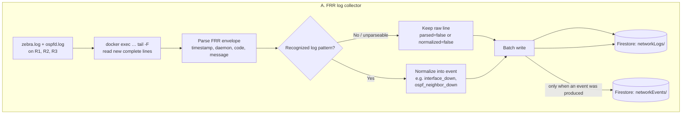
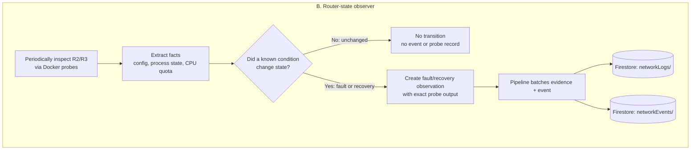
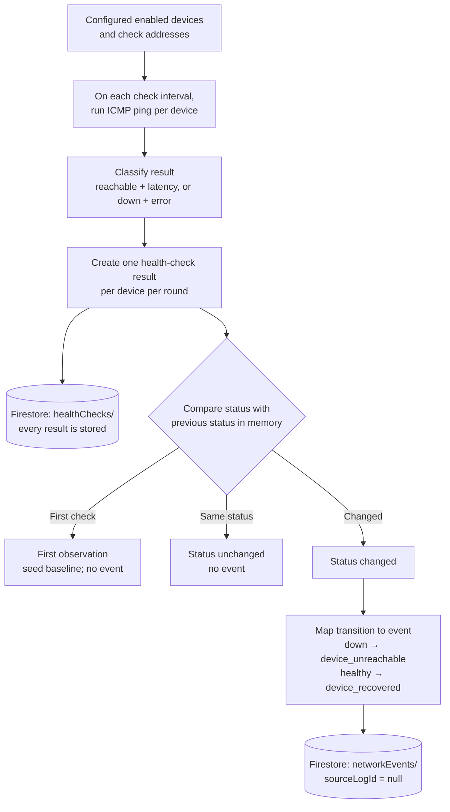

# Function Diagrams

This document collects flow diagrams for specific ACN logic units. The diagrams
show each unit's inputs, transformations, decisions, and outputs.

## Layer 0

Layer 0 has two independent inputs: FRR daemon log files and periodic router
state probes. Both paths use `networkLogs/` for evidence and
`networkEvents/` for recognized transitions.

### FRR log path

Layer 0 follows `zebra.log` and `ospfd.log` on R1–R3. For each complete line,
the parser extracts the timestamp, daemon, message code, and message. Parsing
only identifies the line's structure; normalization applies rules to decide
whether it represents a meaningful event.

Every collected line is retained in `networkLogs/`, including unparseable
lines, routine messages, and lines that do not match an event rule. Recognized
lines also produce normalized events in `networkEvents/`, such as
`interface_down` or `ospf_neighbor_down`. Each such event points back to its
exact raw log document with `sourceLogId`. Writes are buffered and batched.

### Router-state probe path

Separately, Layer 0 periodically reads selected state from R2 and R3. Probes
inspect facts such as R2's OSPF/interface configuration and R3's OSPF process
and CPU quota. The observer compares those facts with known conditions and
remembers whether each condition was active on the previous poll.

An unchanged condition produces no event and no saved probe record. When a
known condition changes, the observer emits a fault or recovery observation.
The exact probe output is retained in `networkLogs/`, and the transition is
written to `networkEvents/`.

Layer 0 recognizes and records observations; it does not correlate them into
incidents, determine a final root cause, or take corrective action.

## Health Service

The Health Service pings configured data-plane addresses. It stores every
check result but creates network events only for reachability state changes.

The service runs ICMP pings against enabled devices' configured check
addresses. Each round produces and stores a health-check result in
`healthChecks/`, including status and latency or an error. A state tracker
compares each status with the last status held in memory:

- The first observation establishes a baseline and emits no event.
- If the status is unchanged, the result is still stored but no event is made.
- If the status changes, the service emits `device_unreachable` or
  `device_recovered` to `networkEvents/`.

These events come from ICMP checks, not FRR log lines, so their `sourceLogId`
is `null`. The `healthChecks/` collection is the history of probe results;
`networkEvents/` contains recognized transitions.

> **Check-error distinction:** the ping layer records unexpected or failed
> checks with an error, but the state tracker compares the resulting `down`
> status. A transition to that status can therefore currently produce
> `device_unreachable` even when the failure is from the check itself rather
> than confirmed device unreachability. 
>
> We can add this as a point of interest, especially if we want to make the system more robust and 
> have more context to go on by.

## Implementation references

- Layer 0 log collection and pipeline:
  [`services/layer-zero/src/pipeline.ts`](../services/layer-zero/src/pipeline.ts)
- Layer 0 FRR parsing:
  [`services/layer-zero/src/normalize/parser.ts`](../services/layer-zero/src/normalize/parser.ts)
- Layer 0 FRR event rules:
  [`services/layer-zero/src/normalize/rules.ts`](../services/layer-zero/src/normalize/rules.ts)
- Layer 0 router-state observer:
  [`services/layer-zero/src/observer/stateObserver.ts`](../services/layer-zero/src/observer/stateObserver.ts)
- Health Service pipeline:
  [`services/health-service/src/service.ts`](../services/health-service/src/service.ts)
- Health check and ping classification:
  [`services/health-service/src/checks/healthCheck.ts`](../services/health-service/src/checks/healthCheck.ts),
  [`services/health-service/src/checks/ping.ts`](../services/health-service/src/checks/ping.ts)
- Health state transitions:
  [`services/health-service/src/checks/stateTracker.ts`](../services/health-service/src/checks/stateTracker.ts)
