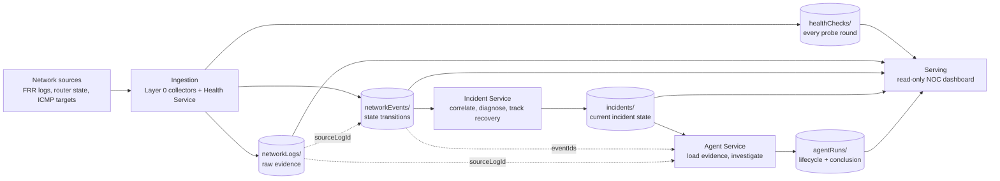

# ACN Data Pipeline

This guide follows network data from where it originates to the places where
an operator or service consumes it. The stages are **source, ingestion,
storage, processing, and serving**. The current pipeline is observability and
investigation only: the AI agent does not make network changes.

## Pipeline overview

## 1. Source: where observations originate

The lab exposes three kinds of observations:

| Source | What it observes | Example |
| --- | --- | --- |
| FRR daemon logs | Messages produced by zebra and ospfd when interfaces or OSPF adjacencies change | R2 reports its OSPF neighbor on `eth2` leaving `Full` |
| Router state | A read-only probe checks intended R2/R3 settings, ospfd process state, and R3's CPU quota | R3's ospfd is stopped while its CPU quota is constrained |
| Reachability targets | The Health Service pings router loopbacks and host data-plane IPs | R3 loopback `10.255.0.3` and PC2 `10.0.3.2` stop replying |

Health checks intentionally target data-plane addresses rather than management
addresses. Management connectivity can remain healthy while the emulated
network is broken, which would hide the fault being monitored.

## 2. Ingestion: how observations enter the system

The Health Service and Layer 0 are separate collectors with different jobs.
They do not wait on one another.

### Health Service

1. Loads the configured device list and upserts its records to `devices/` on
   startup.
2. Periodically pings each enabled device's data-plane `checkAddress`.
3. Produces one health result per device per round.
4. Uses a state tracker to emit a network event only when a device changes
   between healthy and down. Its first observation establishes a baseline and
   does not create a synthetic transition.

### Layer 0

1. Tails the FRR daemon log files mounted from the router containers.
2. Independently polls router state using Docker probes; fault and recovery
   transitions from these probes are fed through the same pipeline.
3. Parses the FRR log envelope, then applies normalization rules to recognize
   meaningful events. Parsing extracts structure; normalization assigns event
   meaning. Routine messages and intermediate OSPF states can produce no event.
4. Buffers observations and writes them in batches, rather than issuing a
   Firestore request for every line.

Every FRR line is retained, including unparsed lines and parsed lines that do
not represent an event. This makes raw device output available when parser or
normalizer rules need improvement.

## 3. Storage: what is persisted

All implemented collections are in Firestore. Backend services use the Admin
SDK; the dashboard uses read-only access.

| Collection | Written by | What each document represents |
| --- | --- | --- |
| `devices/` | Health Service | Current configured device metadata, keyed by device id |
| `healthChecks/` | Health Service | One result per device per polling round; append-only |
| `networkLogs/` | Layer 0 | Every collected FRR line and the probe output accompanying each detected state transition |
| `networkEvents/` | Health Service and Layer 0 | Recognized state transitions from either source |
| `incidents/` | Incident Service | Current lifecycle and diagnosis for a correlated fault, updated in place |
| `agentRuns/` | Agent Service | One investigation lifecycle and result per deterministic diagnosis version |
| `labActions/` | Lab Controller | Operator-triggered scenario status and recent script output |

`networkLogs/` retains the original text in `raw`. Parsed fields are stored
alongside it when available, with `parsed` and `normalized` flags showing how
far processing got. Device event time and collector/server receive time are
both kept where applicable; they answer different timing questions.

For Layer 0 events, `sourceLogId` points to the exact `networkLogs/` document.
The raw log and derived event are written in the same Firestore batch, so the
reference cannot point to a missing log. Health Service ICMP events have
`sourceLogId: null` because no log line produced them.

## 4. Processing: how observations become incidents and investigations

### Event production

`networkEvents/` is the shared stream, not a copy of every raw observation:

- Health Service stores every check in `healthChecks/`, but emits
  `device_unreachable` or `device_recovered` only on a reachability transition.
- Layer 0 stores every input in `networkLogs/`, but emits a `networkEvent`
  only when a normalization rule or state observer recognizes a transition.

Events carry their device, type, severity, attributes, source, and occurrence
time. Their common collection lets later processing correlate symptoms and
router-level evidence.

### Incident correlation

The Incident Service watches new `networkEvents/` documents. It groups related
events within its correlation and settle windows, applies deterministic
root-cause rules, and records the event ids used. The diagnosis includes both
its predicted impact and the independently observed unreachable devices, so a
mismatch stays visible. Recovery updates or resolves the incident according to
the kind of fault; persistent configuration, service, and resource faults
require the state observer's recovery transition.

An incident is updated in place in `incidents/`. It is therefore the current
incident state, while the linked event and log documents preserve the evidence
trail.

### AI investigation

The Agent Service watches settled incidents. For a new diagnosis version it:

1. Claims a deterministic run id to avoid duplicate investigations on listener
   replays or service restarts.
2. Loads the incident's `eventIds` and follows each `sourceLogId` to raw logs.
3. Records evidence and prompt details, then sends the evidence to the
   configured model through the OpenAI Responses API.
4. Validates cited event and log ids, compares its conclusion with the
   deterministic root cause, and stores lifecycle, citations, usage, latency,
   and estimated cost in `agentRuns/`.

The Agent Service has no Docker, SSH, `vtysh`, or network-action capability.
Its investigation does not change the network.

## 5. Serving: who reads the data

The Angular NOC dashboard subscribes to the emulator's Firestore data and
combines recent checks, logs, events, incidents, agent runs, and lab actions
into the operator timeline. It is a viewer: browser Firestore writes are
denied.

Manual fault buttons use a separate path. The browser sends one of a fixed set
of named requests to the localhost-only Lab Controller. The controller runs
the corresponding repository-owned scenario script and writes its lifecycle
and output to `labActions/`. This is an operator demo control, not an AI
remediation interface.

## Example: R2-R3 link failure

1. R2 and R3 write interface/OSPF changes to their FRR logs. Layer 0 tails the
   lines, stores them in `networkLogs/`, and emits normalized events linked by
   `sourceLogId`.
2. On its next polling round, the Health Service finds R3 and PC2 unreachable.
   It writes their results to `healthChecks/` and emits device transition
   events to `networkEvents/`.
3. The Incident Service sees both device symptoms and router-side events,
   correlates them, and writes a link diagnosis with evidence and predicted
   impact to `incidents/`.
4. The Agent Service loads that diagnosis plus linked events and raw logs,
   investigates independently, and records its conclusion and citations in
   `agentRuns/`.
5. The dashboard displays the checks, evidence, events, incident, and
   investigation. An operator may separately ask the Lab Controller to restore
   the synthetic fault; recovery observations then flow through collection
   and processing again.

## Boundaries to keep in mind

- Raw observations, normalized events, incidents, and AI runs are different
  layers of data; a later layer does not replace its evidence.
- Layer 0 emits events but does not decide what constitutes an incident.
- Incident diagnosis is deterministic and does not depend on the AI result.
- The AI investigates and records; it does not remediate.
- The local Lab Controller is separate from that pipeline and is restricted to
  fixed manual scenarios.
